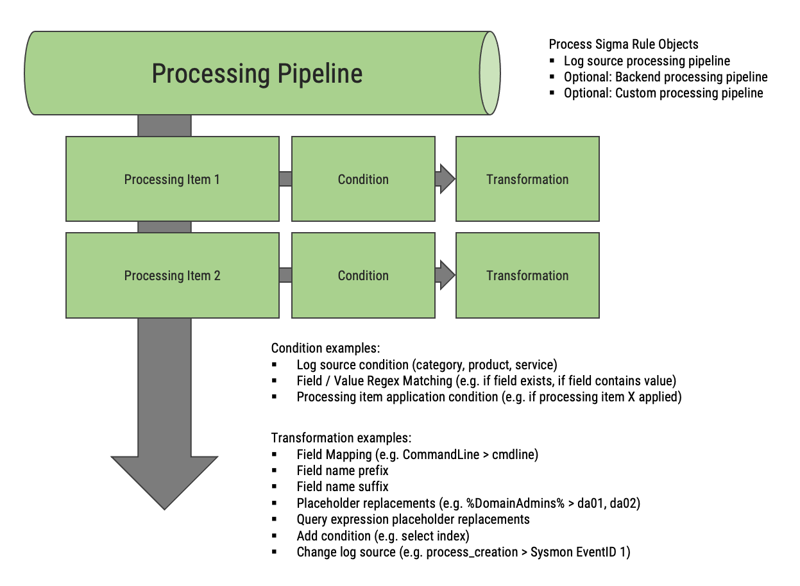

Writing Processing Pipelines
=============================

Processing pipelines are the primary mechanism for transforming Sigma rules before they are
converted into target queries. They handle tasks like field name mapping, log source adjustments,
value transformations, and environment-specific adaptations.

This guide covers both YAML-based and Python-based pipeline definitions, when to use each,
and the full range of available transformations and conditions.

Overview
--------

A processing pipeline consists of three stages applied in order:

1. **Transformations** (rule pre-processing): Modify the Sigma rule structure before conversion.
   These operate on detection items, field names, and values.
2. **Post-processing**: Transform the generated query strings after backend conversion.
3. **Finalizers**: Operate on the complete set of queries for final output formatting.

When to Use YAML vs Python
---------------------------

**Use YAML pipelines when:**

* Defining field mappings and environment-specific configurations.
* Creating reusable pipeline configurations that non-developers can modify.
* Distributing pipelines as configuration files.
* Combining existing transformations without custom logic.

**Use Python pipelines when:**

* Implementing custom transformation logic.
* Creating reusable pipeline packages (plugins).
* Needing dynamic or conditional behavior beyond what YAML supports.
* Building complex pipelines with programmatic construction.

Both approaches use the same underlying ``ProcessingPipeline`` class and can be combined.

Pipeline Priorities
-------------------

When multiple pipelines are combined, they are applied in order of their priority value
(lowest first). The following priority conventions are recommended:

==========  ==============  ===============================================
Priority    Category        Purpose
==========  ==============  ===============================================
10          Log source      Generic log source transformations
20          Backend pre     Transformations before the backend pipeline
50          Backend         Backend-specific transformations (built-in)
60          Output format   Output format-specific transformations
==========  ==============  ===============================================

YAML Pipeline Definition
------------------------

A YAML pipeline has the following top-level structure:

.. code-block:: yaml

   name: my_pipeline
   priority: 20
   allowed_backends:
     - my_backend
   vars:
     custom_var: value
   transformations:
     - id: transformation_1
       type: transformation_type
       # ... transformation parameters ...
       rule_conditions:
         - type: condition_type
           # ... condition parameters ...
       rule_cond_op: and  # or "or"
       rule_cond_not: false
   postprocessing:
     - id: postproc_1
       type: postprocessing_type
       # ... parameters ...
   finalizers:
     - type: finalizer_type
       # ... parameters ...

Top-Level Keys
^^^^^^^^^^^^^^

* ``name``: Optional name identifier for the pipeline.
* ``priority``: Integer priority for ordering when combining pipelines.
* ``allowed_backends``: Optional list of backend identifiers this pipeline is intended for.
* ``vars``: Optional dictionary of variables accessible to transformations.
* ``transformations``: List of rule pre-processing transformation items.
* ``postprocessing``: List of query post-processing items.
* ``finalizers``: List of output finalizer items.

Example: Field Mapping Pipeline
^^^^^^^^^^^^^^^^^^^^^^^^^^^^^^^

.. code-block:: yaml

   name: windows_field_mapping
   priority: 20
   transformations:
     - id: windows_process_creation_fieldmapping
       type: field_name_mapping
       mapping:
         CommandLine: process.command_line
         Image: process.executable
         ParentImage: process.parent.executable
         User: user.name
         LogonId: user.id
         IntegrityLevel: process.integrity_level
       rule_conditions:
         - type: logsource
           category: process_creation
           product: windows

Example: Log Source Transformation
^^^^^^^^^^^^^^^^^^^^^^^^^^^^^^^^^^

.. code-block:: yaml

   name: my_logsource_mapping
   priority: 10
   transformations:
     - id: windows_process_creation_logsource
       type: change_logsource
       category: process_creation
       product: windows
       rule_conditions:
         - type: logsource
           category: process_creation
           product: windows

Example: Value Replacement
^^^^^^^^^^^^^^^^^^^^^^^^^^

.. code-block:: yaml

   name: value_adjustments
   priority: 30
   transformations:
     - id: replace_backslash_path
       type: replace_string
       regex: "\\\\\\\\+"
       replacement: "/"
       field_name_conditions:
         - type: include_fields
           fields:
             - Image
             - ParentImage

Python Pipeline Definition
--------------------------

In Python, pipelines are constructed using the ``ProcessingPipeline``, ``ProcessingItem``,
``QueryPostprocessingItem``, and transformation classes directly:

.. code-block:: python

   from sigma.processing.pipeline import ProcessingPipeline, ProcessingItem, QueryPostprocessingItem
   from sigma.processing.transformations import (
       FieldMappingTransformation,
       ChangeLogsourceTransformation,
       ReplaceStringTransformation,
   )
   from sigma.processing.conditions import LogsourceCondition, IncludeFieldCondition

   pipeline = ProcessingPipeline(
       name="my_pipeline",
       priority=20,
       items=[
           ProcessingItem(
               identifier="field_mapping",
               transformation=FieldMappingTransformation({
                   "CommandLine": "process.command_line",
                   "Image": "process.executable",
               }),
               rule_conditions=[
                   LogsourceCondition(
                       category="process_creation",
                       product="windows",
                   )
               ],
           ),
           ProcessingItem(
               identifier="logsource_change",
               transformation=ChangeLogsourceTransformation(
                   category="endpoint",
               ),
               rule_conditions=[
                   LogsourceCondition(
                       category="process_creation",
                       product="windows",
                   )
               ],
           ),
       ],
   )

Loading Pipelines from YAML
^^^^^^^^^^^^^^^^^^^^^^^^^^^^

.. code-block:: python

   from sigma.processing.pipeline import ProcessingPipeline

   # From a YAML string
   pipeline = ProcessingPipeline.from_yaml(yaml_string)

   # From a file
   with open("pipeline.yml") as f:
       pipeline = ProcessingPipeline.from_yaml(f.read())

Combining Pipelines
^^^^^^^^^^^^^^^^^^^

.. code-block:: python

   combined = pipeline1 + pipeline2

   # Or use the resolver
   from sigma.processing.resolver import ProcessingPipelineResolver
   resolver = ProcessingPipelineResolver()
   resolver.add_pipeline(pipeline1)
   resolver.add_pipeline(pipeline2)
   combined = resolver.resolve(["pipeline1_name", "pipeline2_name"])

Conditions
----------

Conditions control when a transformation is applied. There are three levels of conditions:

* **Rule conditions**: Evaluated against the whole rule (e.g., log source matching).
* **Detection item conditions**: Evaluated against individual detection items.
* **Field name conditions**: Evaluated against field names.

Rule Conditions
^^^^^^^^^^^^^^^

Applied at the processing item level. If all conditions match (by default), the transformation
is applied.

.. list-table::
   :header-rows: 1
   :widths: 25 25 50

   * - YAML Type
     - Python Class
     - Description
   * - ``logsource``
     - ``LogsourceCondition``
     - Match by log source category, product, and/or service.
   * - ``contains_detection_item``
     - ``RuleContainsDetectionItemCondition``
     - Rule contains a detection item with specified field and value.
   * - ``is_sigma_rule``
     - ``IsSigmaRuleCondition``
     - The rule is a regular Sigma rule (not a correlation rule).
   * - ``is_sigma_correlation_rule``
     - ``IsSigmaCorrelationRuleCondition``
     - The rule is a correlation rule.
   * - ``rule_attribute``
     - ``RuleAttributeCondition``
     - Match by rule attribute (title, id, status, level, etc.).
   * - ``rule_tag``
     - ``RuleTagCondition``
     - Match by rule tag.
   * - ``processing_item_applied``
     - ``RuleProcessingItemAppliedCondition``
     - A specific processing item was already applied to this rule.
   * - ``processing_state``
     - ``RuleProcessingStateCondition``
     - Match by pipeline state variable.

**Condition linking**: By default, multiple conditions are combined with AND (all must match).
Use ``rule_cond_op: or`` to use OR logic. Use ``rule_cond_not: true`` to negate the result.

**Condition expressions**: For complex logic, use ``rule_cond_expr`` instead of ``rule_cond_op``:

.. code-block:: yaml

   transformations:
     - id: complex_condition
       type: field_name_mapping
       mapping:
         FieldA: field_a
       rule_conditions:
         cond1:
           type: logsource
           category: process_creation
         cond2:
           type: logsource
           product: windows
       rule_cond_expr: cond1 and not cond2

Detection Item Conditions
^^^^^^^^^^^^^^^^^^^^^^^^^

Applied per detection item within a rule.

.. list-table::
   :header-rows: 1
   :widths: 25 25 50

   * - YAML Type
     - Python Class
     - Description
   * - ``match_string``
     - ``MatchStringCondition``
     - Detection item value matches a string pattern.
   * - ``match_value``
     - ``MatchValueCondition``
     - Detection item value matches a specific value.
   * - ``contains_wildcard``
     - ``ContainsWildcardCondition``
     - Detection item value contains wildcard characters.
   * - ``is_null``
     - ``IsNullCondition``
     - Detection item value is null.
   * - ``detection_item_processing_item_applied``
     - ``DetectionItemProcessingItemAppliedCondition``
     - A specific processing item was applied to this detection item.
   * - ``detection_item_processing_state``
     - ``DetectionItemProcessingStateCondition``
     - Match by processing state.

Field Name Conditions
^^^^^^^^^^^^^^^^^^^^^

Control which field names a transformation applies to.

.. list-table::
   :header-rows: 1
   :widths: 25 25 50

   * - YAML Type
     - Python Class
     - Description
   * - ``include_fields``
     - ``IncludeFieldCondition``
     - Only apply to listed field names (supports wildcards).
   * - ``exclude_fields``
     - ``ExcludeFieldCondition``
     - Exclude listed field names from transformation.
   * - ``field_name_processing_item_applied``
     - ``FieldNameProcessingItemAppliedCondition``
     - A specific processing item was applied.
   * - ``field_name_processing_state``
     - ``FieldNameProcessingStateCondition``
     - Match by processing state.

Transformations Reference
-------------------------

Rule Pre-Processing Transformations
^^^^^^^^^^^^^^^^^^^^^^^^^^^^^^^^^^^^

These are the ``type`` values for the ``transformations`` section.

**Field Transformations:**

.. list-table::
   :header-rows: 1
   :widths: 30 70

   * - Type
     - Description
   * - ``field_name_mapping``
     - Map field names using a dictionary. Supports one-to-many mappings.
   * - ``field_name_prefix_mapping``
     - Map field name prefixes (e.g., ``win.`` → ``windows.``).
   * - ``field_name_function_mapping``
     - Apply a function to field names (e.g., ``lower``, ``upper``).
   * - ``field_name_suffix``
     - Add a suffix to all matching field names.
   * - ``field_name_prefix``
     - Add a prefix to all matching field names.
   * - ``add_field``
     - Add a new field to the rule's fields list.
   * - ``remove_field``
     - Remove a field from the rule's fields list.
   * - ``set_field``
     - Set a field in detection items to a specific name.

**Value Transformations:**

.. list-table::
   :header-rows: 1
   :widths: 30 70

   * - Type
     - Description
   * - ``replace_string``
     - Replace strings in values using regex patterns.
   * - ``map_string``
     - Map string values using a dictionary.
   * - ``regex``
     - Transform values using regex with capture groups.
   * - ``set_value``
     - Set detection item values to a fixed value.
   * - ``convert_type``
     - Convert value types (e.g., string to regex).
   * - ``case``
     - Change case of string values (lower, upper, title).
   * - ``hashes``
     - Split detection items with hash values into separate items per algorithm.

**Detection Item Transformations:**

.. list-table::
   :header-rows: 1
   :widths: 30 70

   * - Type
     - Description
   * - ``drop_detection_item``
     - Remove a detection item from the detection.

**Condition Transformations:**

.. list-table::
   :header-rows: 1
   :widths: 30 70

   * - Type
     - Description
   * - ``add_condition``
     - Add a new condition expression to the detection.

**Rule Transformations:**

.. list-table::
   :header-rows: 1
   :widths: 30 70

   * - Type
     - Description
   * - ``change_logsource``
     - Change the log source category, product, or service.
   * - ``set_custom_attribute``
     - Set a custom attribute on the rule.

**State Transformations:**

.. list-table::
   :header-rows: 1
   :widths: 30 70

   * - Type
     - Description
   * - ``set_state``
     - Set a variable in the pipeline state.

**Placeholder Transformations:**

.. list-table::
   :header-rows: 1
   :widths: 30 70

   * - Type
     - Description
   * - ``value_placeholders``
     - Replace placeholders with lists of values.
   * - ``wildcard_placeholders``
     - Replace placeholders with wildcard patterns.
   * - ``query_expression_placeholders``
     - Replace placeholders with query-language expressions.

**Failure Transformations:**

.. list-table::
   :header-rows: 1
   :widths: 30 70

   * - Type
     - Description
   * - ``rule_failure``
     - Raise an error for rules matching the condition.
   * - ``detection_item_failure``
     - Raise an error for detection items matching the condition.

**Meta Transformations:**

.. list-table::
   :header-rows: 1
   :widths: 30 70

   * - Type
     - Description
   * - ``nested``
     - Apply a nested pipeline to matching rules.

Query Post-Processing Transformations
^^^^^^^^^^^^^^^^^^^^^^^^^^^^^^^^^^^^^

These operate on the query strings generated by the backend.

.. list-table::
   :header-rows: 1
   :widths: 30 70

   * - Type
     - Description
   * - ``embed``
     - Embed query in a prefix/suffix string.
   * - ``simple_template``
     - Apply a simple template to the query string.
   * - ``template``
     - Apply a Jinja2 template with access to rule and pipeline state.
   * - ``json``
     - Embed query into a JSON structure.
   * - ``replace``
     - Replace patterns in the query string using regex.
   * - ``nested``
     - Apply a nested set of post-processing transformations.

Output Finalizers
^^^^^^^^^^^^^^^^^

Finalizers operate on the complete list of generated queries.

.. list-table::
   :header-rows: 1
   :widths: 30 70

   * - Type
     - Description
   * - ``concat``
     - Concatenate all queries with a separator.
   * - ``json``
     - Output all queries as a JSON array.
   * - ``yaml``
     - Output all queries as a YAML document.
   * - ``template``
     - Apply a Jinja2 template to the full query list.
   * - ``nested``
     - Apply a nested set of finalizers.

Complete YAML Example
---------------------

Here is a comprehensive pipeline example:

.. code-block:: yaml

   name: comprehensive_example
   priority: 20
   allowed_backends:
     - splunk
   vars:
     index_name: main
     source_type: WinEventLog
   transformations:
     # Map field names for Windows process creation events
     - id: proc_creation_fields
       type: field_name_mapping
       mapping:
         CommandLine: process
         Image: process_path
         ParentImage: parent_process_path
         User: user
       rule_conditions:
         - type: logsource
           category: process_creation
           product: windows

     # Add index condition
     - id: add_index
       type: add_condition
       conditions:
         index: "{vars.index_name}"
       rule_conditions:
         - type: logsource
           product: windows

     # Change log source
     - id: change_logsource
       type: change_logsource
       category: endpoint
       rule_conditions:
         - type: logsource
           category: process_creation
           product: windows

     # Set pipeline state for query structure
     - id: set_index_state
       type: set_state
       key: index
       value: main

   postprocessing:
     # Prefix all queries with the data source
     - id: add_source
       type: embed
       prefix: "index={pipeline.state[index]} "
       suffix: ""

   finalizers:
     # Concatenate all queries
     - type: concat
       separator: "\\n\\n"

Writing Custom Transformations
------------------------------

To create a custom transformation, subclass the appropriate base class:

.. code-block:: python

   from dataclasses import dataclass
   from sigma.processing.transformations.base import (
       DetectionItemTransformation,
       StringValueTransformation,
       PreprocessingTransformation,
   )
   from sigma.rule import SigmaRule, SigmaDetectionItem
   from sigma.types import SigmaString

   @dataclass
   class MyDetectionItemTransformation(DetectionItemTransformation):
       """My custom transformation that operates on detection items."""
       my_param: str = "default"

       def apply_detection_item(self, detection_item: SigmaDetectionItem) -> None:
           # Modify the detection item in place
           # Mark as applied for condition tracking:
           self.processing_item_applied(detection_item)

   @dataclass
   class MyValueTransformation(StringValueTransformation):
       """Transform string values."""

       def apply_string_value(self, field: str, val: SigmaString) -> SigmaString | None:
           # Return transformed value, or None to keep original
           return SigmaString(val.plain + "_modified")

Pipeline Variables
------------------

Variables defined in the ``vars`` section can be referenced in transformations and
post-processing using the ``{vars.variable_name}`` syntax in template-enabled parameters.

The pipeline state (set by ``set_state`` transformations) is accessible in post-processing
and finalization via ``{pipeline.state[key]}``.

Additionally, the backend automatically sets these pipeline variables:

* ``backend``: Name of the current backend.
* ``output_format``: Current output format.
* ``backend_<option>``: Backend options passed by the user.
