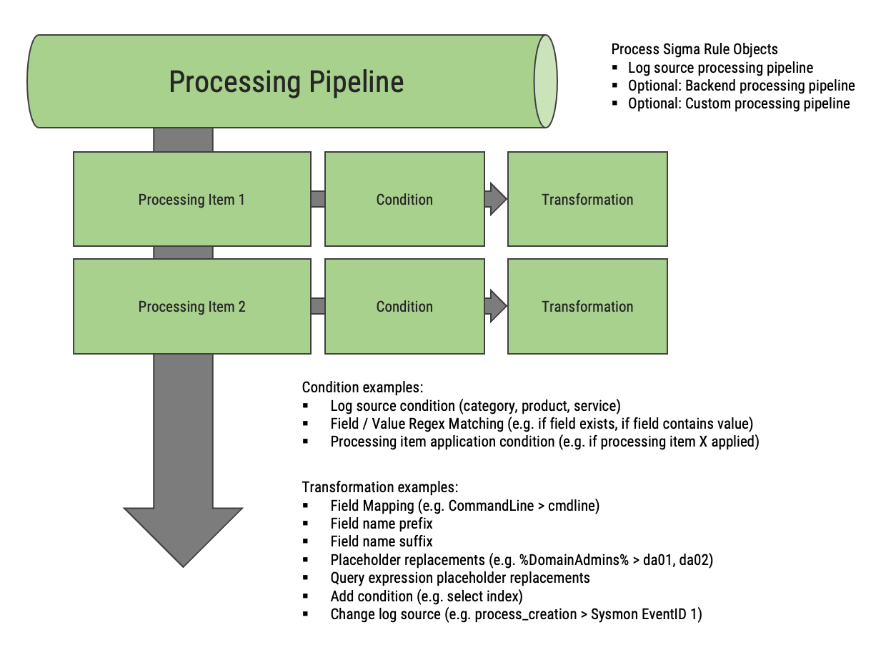

pySigma Documentation
#####################

.. toctree::
   :maxdepth: 1
   :caption: Contents:

   Sigma_Rules
   Processing_Pipelines
   Backends
   Rule_Validation
   Plugin_System
   Breaking_Changes

Overview
********

pySigma is a Python library for parsing, transformation and conversion of Sigma rules. All
functionality is located within the `sigma` package. The following
picture summarizes the conversion process from a Sigma rule into a query, which is covered by pySigma:

.. image:: images/conversion.png

Some basic concepts implemented by pySigma are:

* Parsing of Sigma rules from YAML or a Python dict structure similar to the output of the YAML
  parser into an object-based representation. Details are described :doc:`here <Sigma_Rules>`.
* :doc:`Transformation <Processing_Pipelines>` of parsed Sigma rules by applying *processing pipelines* to them. A
  transformation pipeline consists of *transformation operations* which are executed on whole Sigma
  rules or single detection items or values in a Sigma rule if the *transformation conditions*
  associated with the operations evaluate to true. A transformation pipeline works on and results in
  a Sigma rule object.

* :doc:`Conversion <Backends>` of parsed Sigma rules into query languages. These can be text-based query languages as
  well as data structures that can be used in API calls. The conversion is conducted by so-called
  *conversion backends*.

Depending on the use case pySigma is used for, all or single concepts can be used.

Examples
********

Parsing Sigma Rules
===================

A single Sigma rule can be parsed by the *sigma.rule.SigmaRule* class:::

   rule = SigmaRule.from_yaml(string_with_sigma_rule_yaml)

This results in a *SigmaRule* object.

A rule file can contain multiple Sigma rules or whole repositories of Sigma rules should be handled.
For these purposes *sigma.collection.SigmaCollection* objects should be used, which is as easy as
using SigmaRule objects:::

   rules = SigmaCollection.from_yaml(string_with_sigma_rule_yaml)

Results in a SigmaCollection object with one or multiple SigmaRule objects. Multiple SigmaCollection
objects can be merged into one with:::

   rules = SigmaCollection.merge([rules_1, rules_2, ...])

Single rules in a collection can be accessed with the rules array property:::

   first_rule = SigmaCollection.rules[0]

The properties of a parsed rule can be accessed by their corresponding properties:::

   print("Rule: " + rule.title)

Simple elements like the title or the author are represented by plain Python types. Most attributes
like the log source or detections are represented by special purpose classes that offer further functionality:::

   if rule.logsource not in SigmaLogSource(None, "windows", "sysmon"):
   print("This is not a Sysmon rule!")
   print("Consolidated condition: " + "or".join(rule.detection.condition))

Further details regarding parsing and representation of rules is located :doc:`on a dedicated page <Sigma_Rules>`.

Conversion of Sigma Rules
=========================

Conversion is done by backend classes. A processing pipeline can be passed to the backend on
initialization. Processing pipelines can be provided by:

* The backend itself. The pipeline provided to the backend on initialization is automatically merged
  with the backend-specific pipeline.
* A YAML-based file.
* Included in pySigma or other libraries.

The following example::

   from sigma.pipelines.sysmon import sysmon_pipeline
   pipeline = sysmon_pipeline()
   backend = SplunkBackend(pipeline)
   rules = SigmaCollection.from_yaml(sigma_rule_yaml)
   print("Result: " + "\n".join(backend.convert(rules)))

* Utilizes the :`Sysmon pipeline package <https://github.com/SigmaHQ/pySigma-pipeline-sysmon>`_ that can be installed
  with pip.
* instantiates a Splunk backend.
* Converts a Sigma rule collection into a list of queries and prints it.

Details about the conversion process can be found :doc:`here <Backends>`. Processing pipelines are
described on :doc:`this page <Processing_Pipelines>`.

Indices and tables
******************

* :ref:`genindex`
* :ref:`modindex`
* :ref:`search`
