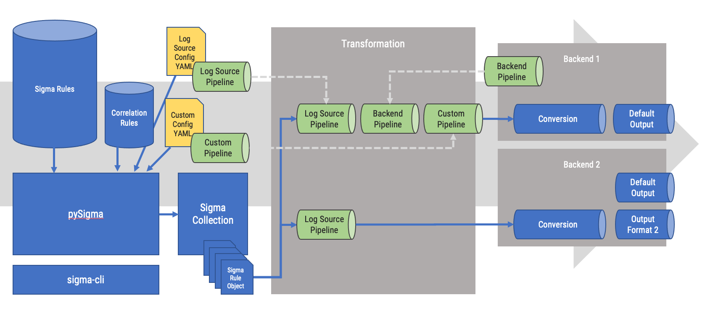

pySigma Documentation
=====================

**pySigma** is a Python library for parsing, processing, and converting `Sigma rules
<https://github.com/SigmaHQ/sigma>`_ into queries for various security monitoring systems.
It is the successor to the legacy ``sigmac`` tool, featuring a clean architecture with
comprehensive testing.

.. toctree::
   :maxdepth: 2
   :caption: Contents

   introduction
   getting_started
   guides/index
   reference/index
   todo

Indices and Tables
==================

* :ref:`genindex`
* :ref:`modindex`
* :ref:`search`
